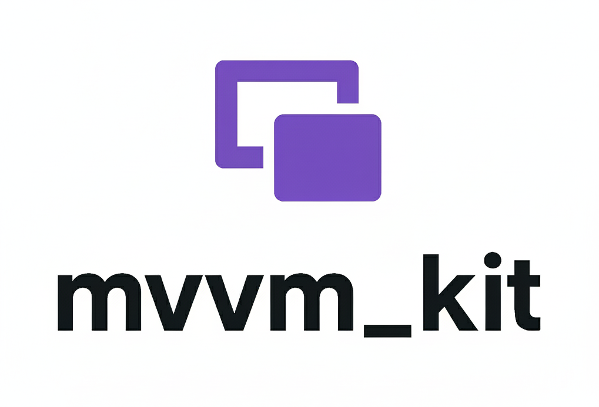

  <br/>
  <br/>
  <p align="center">
    
  </p>

<br/>

[](https://pub.dev/packages/mvvm_kit) &nbsp; [](https://github.com/plooliveira/mvvm_kit/actions)


## Disclaimer
This package is still in early development. While it is functional and can be used in production applications, there may be breaking changes in future releases as we continue to improve and refine the API.

## Overview 


This package provides a simple and lightweight implementation of the MVVM (Model-View-ViewModel) pattern for Flutter applications. It is designed to be easy to use and to help you write clean, testable, and maintainable code.

The core of the package is the `LiveData` class, which is an observable data holder that can be observed by UI components. When the data changes, the UI is automatically updated.

The package also provides a `ViewModel` class, which is a base class for your view models. The `ViewModel` class manages the lifecycle of `LiveData` objects and provides a way to handle long-running actions.

## Installation

To use this package, add `mvvm_kit` as a dependency running `pub add mvvm_kit` or by adding it to your `pubspec.yaml`.


## Usage

### Simple Example

Here is a simple example of how to use the package to create a counter application.

**1. Create a `ViewModel`**

```dart
import 'package:mvvm_kit/mvvm_kit.dart';

class CounterViewModel extends ViewModel {
  final _counter = mutable(0);
  LiveData<int> get counter => _counter;

  void increment() {
    _counter.value++;
  }
}
```

**2. Create a `View`**

```dart
import 'package:flutter/material.dart';
import 'package:mvvm_kit/mvvm_kit.dart';

import 'counter_viewmodel.dart';

class CounterView extends StatefulWidget {
  const CounterView({super.key});

  @override
  State<CounterView> createState() => _CounterViewState();
}

class _CounterViewState extends ViewState<CounterViewModel, CounterView> {
  // By default, ViewState uses a built-in service locator for dependency injection.
  // You can override createViewModel() to provide a different injection strategy. e.g. GetIt, Provider, etc.
  // @override
  // CounterViewModel createViewModel() => GetIt.I<CounterViewModel>();

  @override
  Widget build(BuildContext context) {
    return Scaffold(
      appBar: AppBar(
        title: const Text('Counter'),
      ),
      body: Center(
        child: Watch(
          viewModel.counter,
          builder: (context, value) {
            return Text(
              '$value',
              style: Theme.of(context).textTheme.headlineMedium,
            );
          },
        ),
      ),
      floatingActionButton: FloatingActionButton(
        onPressed: viewModel.increment,
        child: const Icon(Icons.add),
      ),
    );
  }
}
```

Don't forget to register your `CounterViewModel` in the service locator before running the app:

```dart
import 'counter_viewmodel.dart';
import 'package:mvvm_kit/mvvm_kit.dart';

void setupLocator() {
  SL.I.registerFactory(() => CounterViewModel());
  // Or using other service locators like GetIt
  // GetIt.I.registerFactory<CounterViewModel>(() => CounterViewModel());
}

void main() {
  setupLocator();
  runApp(const MyApp());
}
```

### Listen to multiple LiveData

You can use `GroupWatch` to listen to multiple `LiveData` objects at once. You can also use the `onActive` and `onInactive` callbacks in your `ViewModel` to perform actions when the view becomes active or inactive.

```dart
import 'package:mvvm_kit/mvvm_kit.dart';

class PersonViewModel extends ViewModel {
  final _name = mutable('John Doe');
  final _age = mutable(30);
  
  LiveData<String> get name => _name;
  LiveData<int> get age => _age;

  @override
  void onActive() {
    // Perform actions when the view becomes active
  }
  
  @override
  void onInactive() {
    // Perform actions when the view becomes inactive
  }
}
```

```dart
import 'package:flutter/material.dart';
import 'package:mvvm_kit/mvvm_kit.dart';

import 'person_viewmodel.dart';

class PersonView extends StatefulWidget {
  const PersonView({super.key});

  @override
  State<PersonView> createState() => _PersonViewState();
}

class _PersonViewState extends ViewState<PersonViewModel, PersonView> {

  @override
  Widget build(BuildContext context) {
    return Scaffold(
      appBar: AppBar(
        title: const Text('Group Watch Example'),
      ),
      body: Center(
        child: GroupWatch(
          [viewModel.name, viewModel.age],
          builder: (context) {
            final name = viewModel.name.value;
            final age = viewModel.age.value;

            return Text(
              '$name is $age years old.',
              style: Theme.of(context).textTheme.headlineMedium,
            );
          },
        ),
      ),
    );
  }
}
```

## Built-in Service Locator (SL)
The package includes a simple built-in service locator called `SL` that you can use to register and retrieve your `ViewModel` instances or other dependencies. This is useful for all kinds of applications that has a minimalistic dependency injection graph.
You can register your dependencies like this:

```dart
import 'package:mvvm_kit/mvvm_kit.dart'; 

// As factory
SL.instance.registerFactory(() => CounterViewModel());
// As singleton (Use the shortcut .I for convenience)
SL.I.registerSingleton(() => CounterRepository());
```

And retrieve any registered type like this:

```dart
final counterViewModel = SL.I.get<CounterViewModel>();
```

Ps: The ViewState class uses this service locator by default to create ViewModel instances. You can override the `createViewModel()` method to use a different dependency injection strategy if needed.

## Key Features

- **LiveData**: Observable data holders that notify observers when values change,
- **ViewModel**: Lifecycle-aware UI logic layer with automatic resource management
- **Watch/GroupWatch**: Widgets for observing LiveData changes
- **DataScope**: Container that automatically disposes LiveData instances when no longer needed, preventing memory leaks
- **Transformations**: `transform()`, `filtered()`, `mirror()` for data manipulation
- **HotswapLiveData**: Dynamically switch between data sources

## Documentation

For more detailed documentation, please visit the [MVVM Kit Library reference](https://pub.dev/documentation/mvvm_kit/latest/mvvm_kit/).